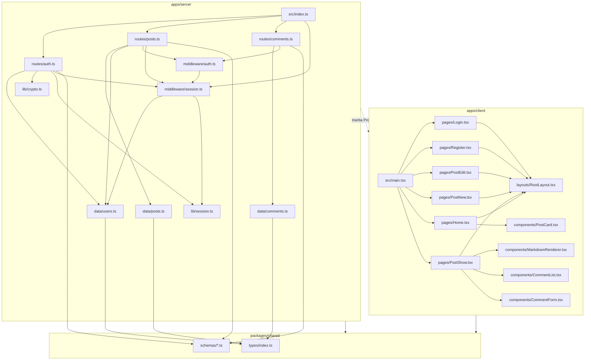

# コンポーネント依存関係マトリクス

**プロジェクト**: Hono x Inertia.js x React ブログサイト
**作成日**: 2026-05-04
**バージョン**: 1.0
**ステータス**: レビュー中

---

## 1. パッケージ間依存関係

```
packages/shared
    ^         ^
    |         |
apps/server  apps/client
```

| 依存元 | 依存先 | 内容 |
|--------|--------|------|
| apps/server | packages/shared | 型定義（User, Post, Comment）・Zod スキーマ |
| apps/client | packages/shared | 型定義（PublicUser, Post, Comment）・Zod スキーマ |
| apps/server | apps/client | なし（サーバーはクライアントに依存しない） |
| apps/client | apps/server | なし（クライアントはサーバーに直接依存しない。Inertia プロトコル経由のみ） |

---

## 2. apps/server コンポーネント依存マトリクス

| コンポーネント | 依存するコンポーネント |
|--------------|-------------------|
| `src/index.ts` | `src/routes/auth.ts`, `src/routes/posts.ts`, `src/routes/comments.ts`, `src/middleware/session.ts` |
| `src/routes/auth.ts` | `src/data/users.ts`, `src/lib/crypto.ts`, `src/lib/session.ts`, `src/middleware/session.ts` |
| `src/routes/posts.ts` | `src/data/posts.ts`, `src/data/users.ts`, `src/middleware/auth.ts`, `src/middleware/session.ts` |
| `src/routes/comments.ts` | `src/data/comments.ts`, `src/middleware/auth.ts` |
| `src/middleware/auth.ts` | `src/middleware/session.ts`（currentUser を参照） |
| `src/middleware/session.ts` | `src/data/users.ts`, `src/lib/session.ts` |
| `src/data/users.ts` | `packages/shared`（User 型） |
| `src/data/posts.ts` | `packages/shared`（Post 型） |
| `src/data/comments.ts` | `packages/shared`（Comment 型） |
| `src/lib/crypto.ts` | なし（Web Crypto API のみ） |
| `src/lib/session.ts` | なし（Web Crypto API のみ） |

---

## 3. apps/client コンポーネント依存マトリクス

| コンポーネント | 依存するコンポーネント |
|--------------|-------------------|
| `src/main.tsx` | `src/pages/*`（全ページコンポーネント動的解決） |
| `src/layouts/RootLayout.tsx` | Inertia `usePage` |
| `src/pages/Home.tsx` | `src/layouts/RootLayout.tsx`, `src/components/PostCard.tsx` |
| `src/pages/PostShow.tsx` | `src/layouts/RootLayout.tsx`, `src/components/MarkdownRenderer.tsx`, `src/components/CommentList.tsx`, `src/components/CommentForm.tsx` |
| `src/pages/PostNew.tsx` | `src/layouts/RootLayout.tsx`, Inertia `useForm` |
| `src/pages/PostEdit.tsx` | `src/layouts/RootLayout.tsx`, Inertia `useForm` |
| `src/pages/Register.tsx` | `src/layouts/RootLayout.tsx`, Inertia `useForm` |
| `src/pages/Login.tsx` | `src/layouts/RootLayout.tsx`, Inertia `useForm` |
| `src/components/PostCard.tsx` | なし（純粋 UI コンポーネント） |
| `src/components/CommentList.tsx` | なし（純粋 UI コンポーネント） |
| `src/components/CommentForm.tsx` | Inertia `useForm` |
| `src/components/MarkdownRenderer.tsx` | `marked` または `react-markdown` ライブラリ |

---

## 4. 依存関係図



---

## 5. Inertia データフロー

```
サーバー (Hono)                    クライアント (React)
─────────────────────────────────────────────────────
ルートハンドラ
  └── c.render('PageName', props)
        │
        ├─[初回リクエスト]──→ HTML + <div id="app" data-page='{...}' />
        │                         └── main.tsx がハイドレーション
        │
        └─[Inertia リクエスト]──→ JSON { component, props, url }
                                   └── React が差分更新
```

**共有 Props（全ページで利用可能）**:

```typescript
// サーバー側で Inertia ミドルウェアが自動付与
{
  currentUser: PublicUser | null
}
```

---

## 6. セキュリティ境界

| 境界 | 保護方法 |
|------|---------|
| 認証必須ルート | `requireAuth` ミドルウェア（サーバーサイド） |
| 所有者チェック | ルートハンドラ内で `post.authorId === currentUser.id` を検証 |
| パスワード保護 | PBKDF2 ハッシュ（Web Crypto API）、平文はログに出力しない |
| セッション改ざん防止 | HMAC-SHA256 署名付き Cookie |
| CSRF 対策 | Inertia の X-XSRF-TOKEN ヘッダー検証 |
| XSS 対策 | React の自動エスケープ、MarkdownRenderer は sanitize 処理を実施 |

---

*作成: AI-DLC Application Design ステージ*
*最終更新: 2026-05-04*
