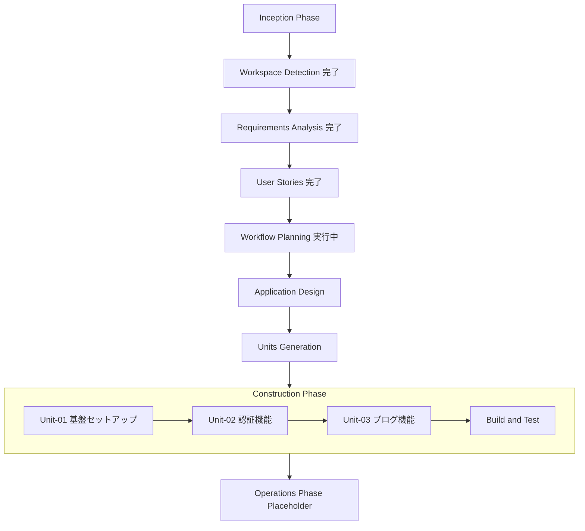
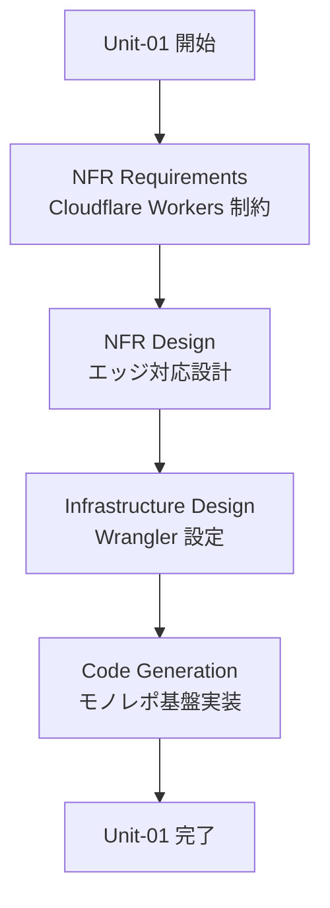
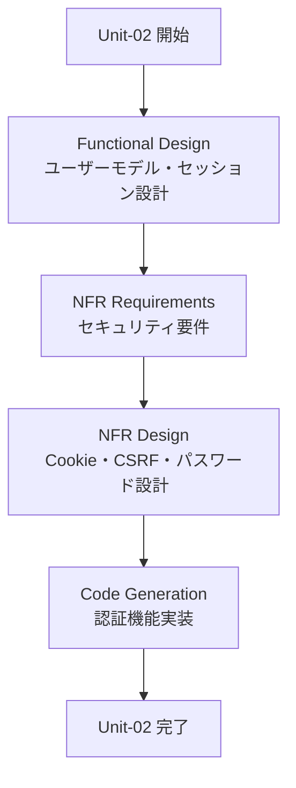
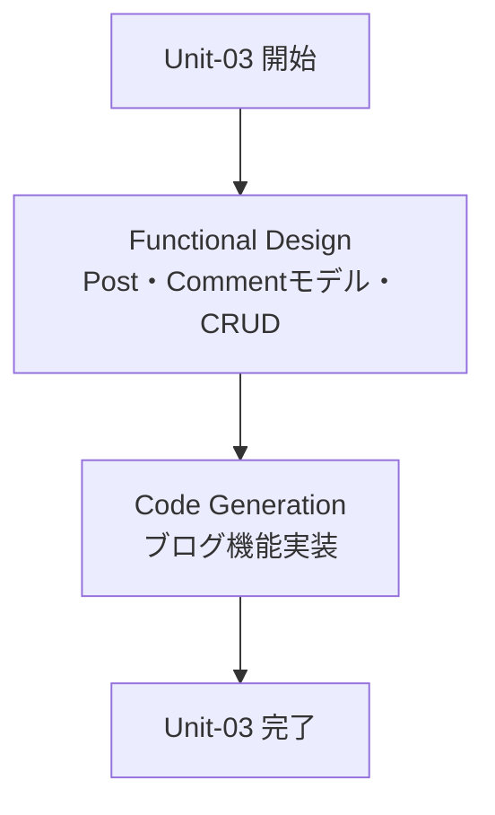

# 実行計画書（Execution Plan）

**プロジェクト**: Hono × Inertia.js × React ブログサイト
**作成日**: 2026-05-04
**バージョン**: 1.0
**ステータス**: 承認待ち

---

## 1. 計画概要

本プロジェクトは技術学習目的のブログサイトである。
モックデータのみ使用・テストなし・Cloudflare Workers デプロイを優先する。
複雑度は「標準」レベルと判断し、各フェーズを適切な深度で実行する。

---

## 2. Inception フェーズ 実行結果

| ステージ | 判定 | 実行深度 | 理由 |
|---------|------|---------|------|
| Workspace Detection | 実行済み | - | 常時実行 |
| Reverse Engineering | スキップ | - | 実質 Greenfield |
| Requirements Analysis | 実行済み | Standard | 通常複雑度、承認済み |
| User Stories | 実行済み | Standard | 複数ユーザータイプ・機能要件あり、承認済み |
| Workflow Planning | 実行中 | Standard | 常時実行 |
| Application Design | 実行予定 | Standard | 新規コンポーネント設計が必要 |
| Units Generation | 実行予定 | Standard | 複数 Unit への分解が必要 |

---

## 3. Construction フェーズ Unit 分解方針

### 3.1 Unit 分解の根拠

本プロジェクトは以下の 3 つの独立した機能領域を持つ。
各領域はほぼ独立して実装可能であるため、Unit として分割する。

### 3.2 Unit 一覧

| Unit ID | 名称 | 対応要件 | 対応 US | 実装順序 |
|---------|------|---------|---------|---------|
| Unit-01 | 基盤セットアップ | NFR全般 | - | 1番目（依存なし） |
| Unit-02 | 認証機能 | FR-005, FR-006, FR-007 | US-003, US-004, US-007 | 2番目（Unit-01 依存） |
| Unit-03 | ブログ機能 | FR-001, FR-002, FR-003, FR-004, FR-008, FR-009 | US-001, US-002, US-005, US-006, US-008 | 3番目（Unit-02 依存） |

### 3.3 Unit 詳細

#### Unit-01: 基盤セットアップ

- pnpm モノレポ初期設定（workspace.yaml・共通 package.json・biome.json）
- apps/server: Hono エントリポイント・Wrangler 設定・Vite 設定
- apps/client: React + TypeScript + Inertia.js セットアップ・Tailwind CSS・Shadcn/ui
- packages/shared: 共通型定義・Zod スキーマ基盤
- Cloudflare Workers 対応設定

#### Unit-02: 認証機能

- ユーザーモックデータ定義
- セッション管理（HttpOnly Cookie / Cookie ベース）
- 認証ミドルウェア（保護ルート）
- /register ページ（登録フォーム・バリデーション）
- /login ページ（ログインフォーム・バリデーション）
- ログアウト処理
- ナビゲーションの認証状態表示

#### Unit-03: ブログ機能

- 記事・コメントモックデータ定義
- / ページ（記事一覧・カード表示）
- /posts/:id ページ（記事詳細・コメント一覧）
- /posts/new ページ（記事投稿フォーム・認証保護）
- /posts/:id/edit ページ（記事編集フォーム・認証保護・所有者チェック）
- コメント投稿機能

---

## 4. Construction フェーズ 各 Unit のステージ計画

### Unit-01: 基盤セットアップ

| ステージ | 判定 | 理由 |
|---------|------|------|
| Functional Design | スキップ | 新規データモデルなし、設定のみ |
| NFR Requirements | 実行 | Cloudflare Workers 制約・バンドルサイズ・Web標準API |
| NFR Design | 実行 | NFR Requirements 実行のため |
| Infrastructure Design | 実行 | Wrangler・Workers KV・デプロイ設定が必要 |
| Code Generation | 実行 | 常時実行 |

### Unit-02: 認証機能

| ステージ | 判定 | 理由 |
|---------|------|------|
| Functional Design | 実行 | ユーザーデータモデル・セッション設計・パスワードハッシュ |
| NFR Requirements | 実行 | セキュリティ（HttpOnly Cookie・CSRF・argon2/bcrypt） |
| NFR Design | 実行 | NFR Requirements 実行のため |
| Infrastructure Design | スキップ | Unit-01 で設定済み |
| Code Generation | 実行 | 常時実行 |

### Unit-03: ブログ機能

| ステージ | 判定 | 理由 |
|---------|------|------|
| Functional Design | 実行 | Post・Comment データモデル・CRUD ロジック |
| NFR Requirements | スキップ | 主要 NFR は Unit-01/02 で対応済み |
| NFR Design | スキップ | NFR Requirements スキップのため |
| Infrastructure Design | スキップ | Unit-01 で設定済み |
| Code Generation | 実行 | 常時実行 |

---

## 5. 全体ワークフロー図

---

## 6. Unit-01 詳細フロー

---

## 7. Unit-02 詳細フロー

---

## 8. Unit-03 詳細フロー

---

## 9. 推奨実装順序の根拠

1. **Unit-01 を最初に実行**: 他の全 Unit が依存するモノレポ基盤・環境設定を先に確立する
2. **Unit-02 を2番目に実行**: 認証ミドルウェアが Unit-03 のルート保護に必要
3. **Unit-03 を最後に実行**: 認証基盤の上にブログ機能を構築し、認証保護ルートを正しく実装できる

---

## 10. 推定スコープ

| 項目 | 内容 |
|------|------|
| 総ページ数 | 6ページ（/ / /posts/:id / /posts/new / /posts/:id/edit / /register / /login） |
| サーバーエンドポイント | 約 12 本（GET/POST/PUT/DELETE × 各リソース） |
| Reactコンポーネント | 約 20 個（ページ + 共有コンポーネント） |
| 共有型定義 | User / Post / Comment + Zod スキーマ |
| モックデータ | users.ts / posts.ts / comments.ts |

---

## 11. 注意事項・リスク

| リスク | 対策 |
|--------|------|
| Cloudflare Workers のバンドルサイズ超過（1MB制限） | argon2 の代替として bcrypt や Web Crypto API を検討 |
| Workers 上の argon2 非対応 | bcrypt-edge または Web Crypto API（PBKDF2）を代替として使用 |
| Inertia.js と Hono の統合複雑度 | @hono/inertia の公式ドキュメントを参照し、検証済みパターンを使用 |
| セッション永続化（Workers KV 不使用の場合） | JWT Cookie または Cookie ベースの署名付きセッションで代替 |

---

## 12. スキップしたステージ一覧

| ステージ | 理由 |
|---------|------|
| Reverse Engineering | 実質 Greenfield プロジェクト |
| Unit-01 Functional Design | 設定・セットアップのみ、ビジネスロジックなし |
| Unit-02 Infrastructure Design | Unit-01 でカバー済み |
| Unit-03 NFR Requirements | Unit-01/02 でセキュリティ・性能 NFR を網羅済み |
| Unit-03 Infrastructure Design | Unit-01 でカバー済み |

---

*作成: AI-DLC Workflow Planning ステージ*
*最終更新: 2026-05-04*
