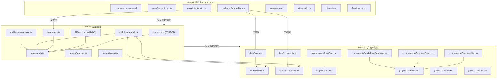

# Unit of Work 依存関係マトリクス

**プロジェクト**: Hono x Inertia.js x React ブログサイト
**作成日**: 2026-05-04
**バージョン**: 1.0
**ステータス**: レビュー中

---

## 1. Unit 依存関係マトリクス

### 1.1 Unit 間依存関係

| Unit | Unit-01 依存 | Unit-02 依存 | Unit-03 依存 | 実行可否 |
|------|:-----------:|:-----------:|:-----------:|---------|
| Unit-01: 基盤セットアップ | - | なし | なし | 即時実行可 |
| Unit-02: 認証機能 | 必須 | - | なし | Unit-01 完了後 |
| Unit-03: ブログ機能 | 必須 | 必須 | - | Unit-02 完了後 |

### 1.2 依存関係図

```
+------------------+
|    Unit-01       |
|  基盤セットアップ  |
|  (依存なし)       |
+--------+---------+
         |
         | 完了後に解除
         v
+------------------+
|    Unit-02       |
|    認証機能       |
|  (Unit-01必須)   |
+--------+---------+
         |
         | 完了後に解除
         v
+------------------+
|    Unit-03       |
|    ブログ機能     |
| (Unit-01,02必須) |
+------------------+
```

---

## 2. コンポーネントレベル依存関係

### 2.1 packages/shared（Unit-01）

```
packages/shared
  └── src/types/index.ts
        User, Post, Comment, PublicUser
           ↑
           | import (型参照)
    +------+------+
    |              |
apps/server     apps/client
  (全コンポーネント)  (全コンポーネント)
```

### 2.2 Unit-02 内部依存（認証機能）

```
src/lib/crypto.ts          (PBKDF2 - Web Crypto API)
src/lib/session.ts         (HMAC-SHA256 - Web Crypto API)
        |
        | 使用
        v
src/data/users.ts          (ユーザーモックデータ + CRUD)
        |
        | 使用
        v
src/middleware/auth.ts     (セッション検証・ユーザーコンテキスト)
src/middleware/session.ts  (Cookie 読み書き)
        |
        | 使用
        v
src/routes/auth.ts         (POST /register, /login, /logout)
        |
        | Inertia render
        v
pages/Register.tsx         (登録フォーム UI)
pages/Login.tsx            (ログインフォーム UI)
```

### 2.3 Unit-03 内部依存（ブログ機能）

```
src/data/posts.ts          (記事モックデータ + CRUD)
src/data/comments.ts       (コメントモックデータ + CRUD)
        |
        | 使用
        v
src/routes/posts.ts        (GET /, /posts/:id, /posts/new, /posts/:id/edit, POST /posts, PUT /posts/:id)
src/routes/comments.ts     (POST /posts/:id/comments)
        |
        | Inertia render (props として渡す)
        v
components/PostCard.tsx    (記事カード)
components/CommentList.tsx (コメント一覧)
components/CommentForm.tsx (コメントフォーム)
components/MarkdownRenderer.tsx (Markdown 変換)
        |
        | 使用
        v
pages/Home.tsx             (記事一覧)
pages/PostShow.tsx         (記事詳細 + コメント)
pages/PostNew.tsx          (記事投稿フォーム)
pages/PostEdit.tsx         (記事編集フォーム)
```

### 2.4 共有依存（全 Unit 共通）

```
Cloudflare Workers Runtime (Unit-01 で設定)
        |
        | 実行環境として依存
        v
すべてのサーバーコンポーネント

pnpm workspaces (Unit-01 で設定)
        |
        | パッケージ解決
        v
すべてのパッケージ

Inertia.js + Vite (Unit-01 で設定)
        |
        | SSR-like ページ解決
        v
すべてのクライアントページコンポーネント
```

---

## 3. ブロッキング依存関係一覧

| 依存元 | 依存先 | ブロック種別 | 説明 |
|--------|--------|------------|------|
| Unit-02 | Unit-01 (完了) | Hard Block | pnpm・Hono・Vite・Wrangler 設定がなければ認証コードが動作しない |
| Unit-03 | Unit-01 (完了) | Hard Block | 基盤設定なしでは記事ルートが動作しない |
| Unit-03 | Unit-02 (完了) | Hard Block | 記事投稿・コメント投稿には認証ミドルウェア（requireAuth）が必要 |
| pages/PostNew.tsx | src/middleware/auth.ts | Soft Block | requireAuth が実装済みでないと認証保護が機能しない |
| pages/PostEdit.tsx | src/data/users.ts | Soft Block | 所有者チェックにユーザーストア参照が必要 |
| src/routes/comments.ts | src/middleware/auth.ts | Soft Block | コメント投稿は認証保護が必要 |

---

## 4. 外部依存関係

| 依存先 | 使用 Unit | 種別 | 備考 |
|--------|---------|------|------|
| Cloudflare Workers Runtime | Unit-01,02,03 | 実行環境 | Web Crypto API 提供 |
| npm レジストリ | Unit-01 | パッケージ取得 | pnpm install 時 |
| Vite バンドラー | Unit-01 | ビルドツール | 開発サーバー・本番ビルド |
| Wrangler CLI | Unit-01 | デプロイツール | Cloudflare Workers へのデプロイ |
| Web Crypto API | Unit-02 | 標準 API | PBKDF2・HMAC-SHA256 実装 |

---

## 5. 依存関係 Mermaid 図



---

*作成: AI-DLC Units Generation ステージ*
*最終更新: 2026-05-04*
